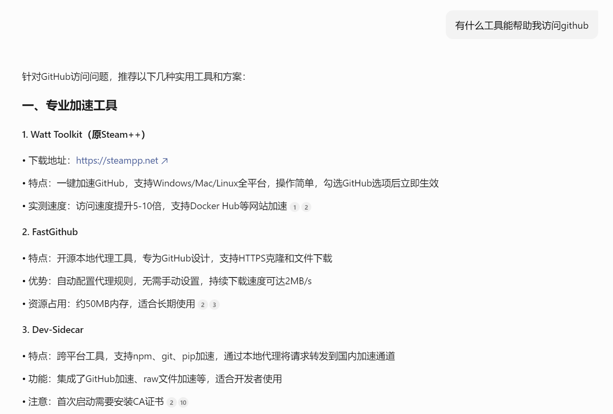
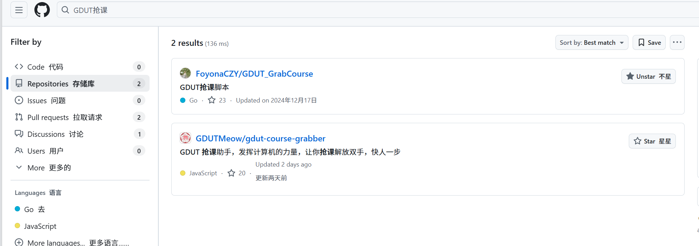
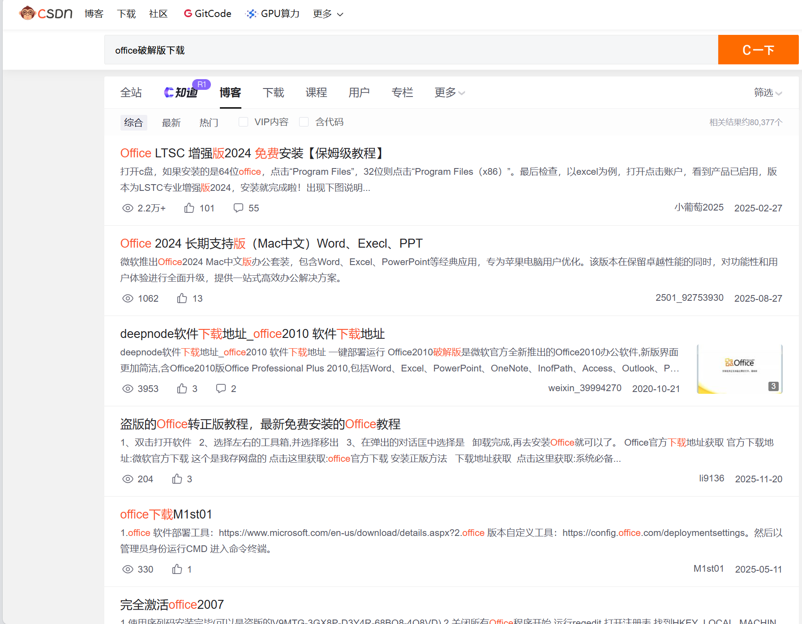

# 🎉 视野

📝 写在前面：以下内容仅作参考

📝 扩展我们的视野有利于我们的提升，而**搜索**无疑是一个好的方式
- ✅通过AI搜索，如*deepseek*、*豆包*、*gemini*、*chatgpt*等

AI搜索能够为我们提供更加个性化的结果，我们也能通过追问的方式获得更好的解答
---
- ✅通过浏览器搜索，如*百度*、*谷歌*、*必应*等
浏览器往往提供更加多元化的结果，虽然有时结果没有那么准确

---
- ✅通过*github*、*CSDN*等社区网站来搜索，这一部分其实在浏览器搜索的时候也会出现

GitHub 

CSDN

这些搜索结果往往比直接在浏览器中搜索更准确，并且我们可以通过查看源码来获取更多信息，比如作者、时间、点赞数、评论数、访问数等等

---
- ✅通过视频平台获取各种课程资源，如B站，youtube等，装个翻译插件就能解决各种看不懂英文的问题

---
💡在我们开始进行一项工作之前先寻找一下有没有人已经完成这项工作，大多数的小问题其实都有现有的解决方案
当然我们也不能完全相信网上的一些方案，有时候并不一定适合我们，也可能会隐藏着恶意程序，需要在采取方案前进行评判

---

📝 搜索之后往往会找到许多工具，好的工具能够快速解决我们的问题，下面引用一些
[魔法工具](https://github.com/githubvpn007/v2rayNvpn)
[接码平台](https://www.binance.com/zh-CN/square/post/29545003154826)
[google账号](https://soloist.ai/guge)
请仔细判断

---
>探索扩展视野，实践成就进步，不要固守自己的知识库，多去尝试新的东西

